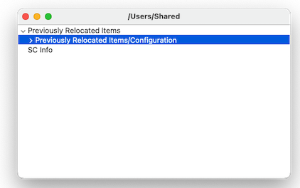

# FindEmptyFolders
A macOS app, in Objective-C for finding, showing, and deleting empty folders

## Why

Finding empty folders on macOS isn't easy because of the presence of hidden .DS_Store files. 

Folders that contain only empty folders are themselves empty folders.

This program explores a tree of folders given a root folder, and lets you see the empties.

## Sample Screenshot

## User Manual:

Point this app at a folder and it will find empty folders within it.

Double click on a row to see the empty folder in the Finder.

Use 'Delete' on the Edit or right-click menu to delete the selected folders.

You can flip between folder name only view or full partial paths using the Settings (i.e. Preferences) pane.

## License

Apache License.
